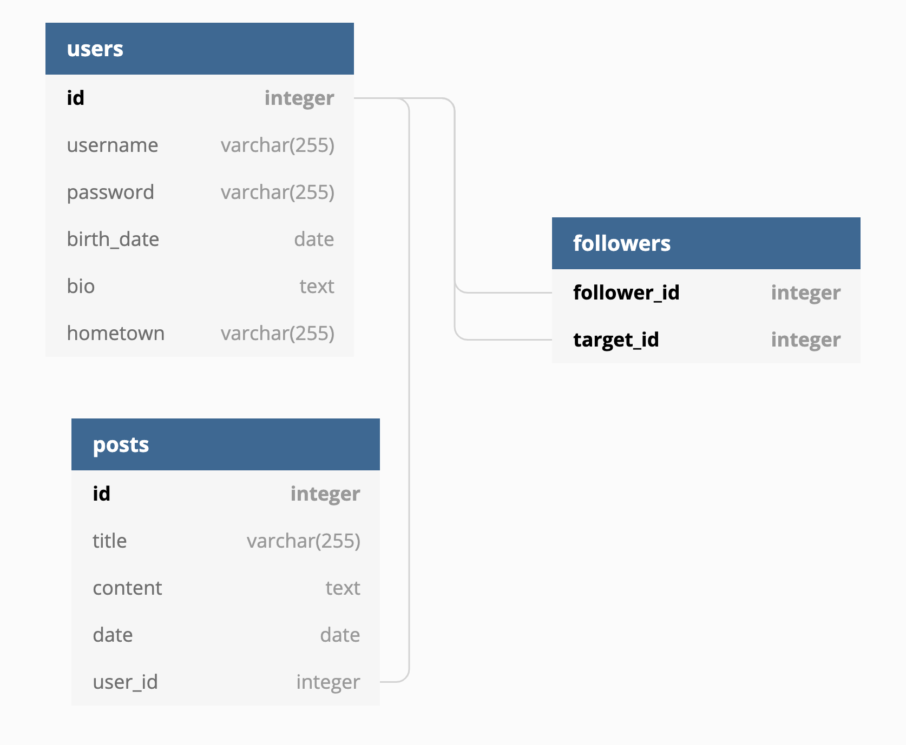

# go-tin

Go-tin is new, one of a kind social network developed as a project for FMI course Clean Code in 2019.
The project is currently in active development, for up-to-date status you can visit the `dev` branch.

# Database schema

# REST API
At first you will authenticate on each call with Basic Authentication

- You can register in the application.
  -  POST /v1/users <json-body>
- You can post text quotes on your profile.
  -  POST /v1/posts <json-body>
- You can  follow a user.
  -  PUT /follow/{username}
- You can unfollow a user.
  -  DELETE /follow/{username}
- You can query posts of all users you follow hronologically.
  -  GET /posts
- You can query your followers.
  -  GET /followers
- You can query the users you follow.
  -  GET /following
- You can query a single user by username.
  -  GET /users/{username}